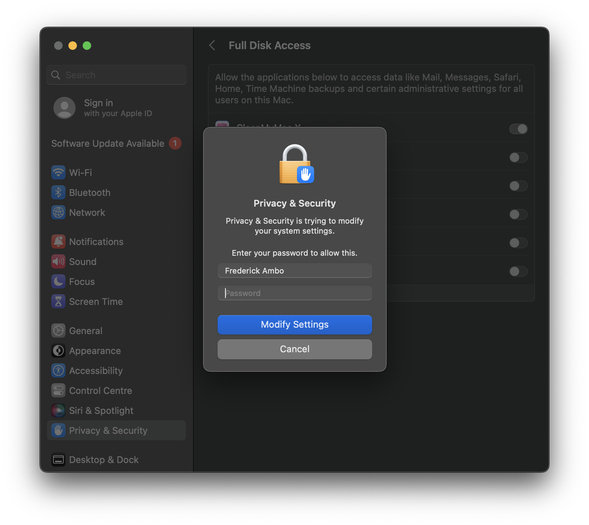

# XPipe Terminal Configuration
This is the settings for what terminal you wanna use with XPipe.  
(It is recommened to use the default terminal emulator)

### Terminal emulator
You can choose what terminal emulator you wanna use here.

In the dropdown menu you can see status icons on what terminal emulators you have on the system, and what terminal emulators will work with XPipe.

The `Test` is to "test" if the terminal emulator is working correctly with XPipe. 

## MacOS Terminal Issues 

Please test the terminal via `XPipe -> Settings -> Terminal -> Press "Test"`.

**Common MacOS Permission issue:**
Check your privacy settings in the `Settings` app, then navigate to `Privacy and Security`. Go to the `Full Disk Access`, and add the terminal if is not there in the list via the `+` icon in the lower left. If it’s already there try removing it and re-adding it. Sometimes it helps closing the terminal via the dock and reopen it. 

#### Visuel guide:

Open your `Settings` app

Select `Full Disk Access`

Add the terminal you need via the `+` icon on the lower left. And a popup will appear, like below asking for your password.

Select the app via the `Applications` folder on the left in the file browser (finder).

Your list should now look like this:

---
Alternatively you can re-install the terminal.