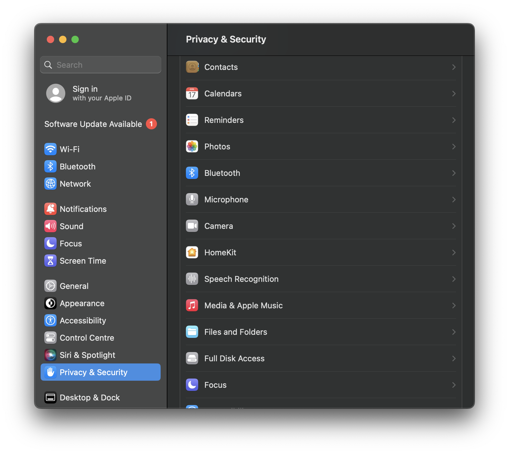
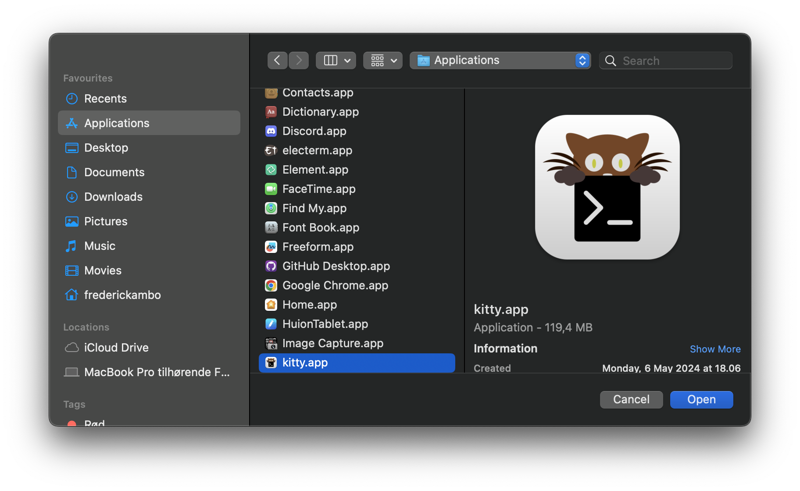
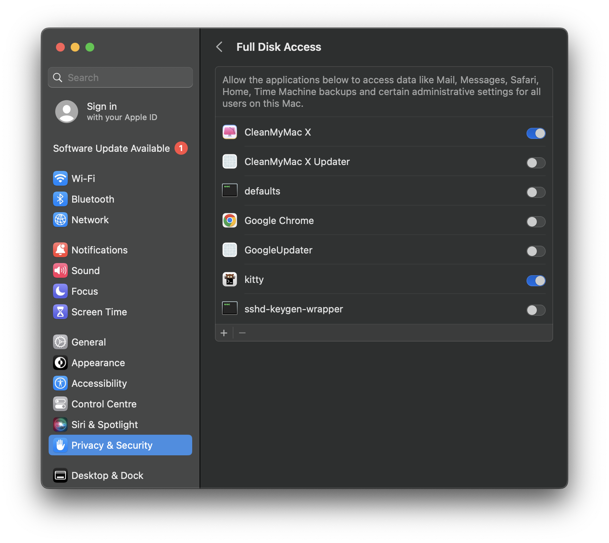

# Terminal Configuration

This is the settings for what terminal you want to use with XPipe.

## MacOS Terminal Issues 

Please test the terminal via `XPipe -> Settings -> Terminal -> Press "Test"`.

**Common macOS Permission issue:**
Check your privacy settings in the `Settings` app, then navigate to `Privacy and Security`.
Go to the `Full Disk Access`, and add the terminal if is not there in the list via the `+` icon in the lower left.
If it’s already there try removing it and re-adding it.
Sometimes it helps to close the terminal via the dock and reopen it. 
os x sonoma
#### Visual guide:

  Current documentation follows MacOS X version `sonoma`.

 

Open your `Settings` app

Select `Full Disk Access`

Add the terminal and XPipe via the `+` icon on the lower left.
And a popup will appear, like below asking for your password.

Select the app via the `Applications` folder on the left in the file browser (finder).

Your list should now look like this:

---
Alternatively, you can re-install the terminal.